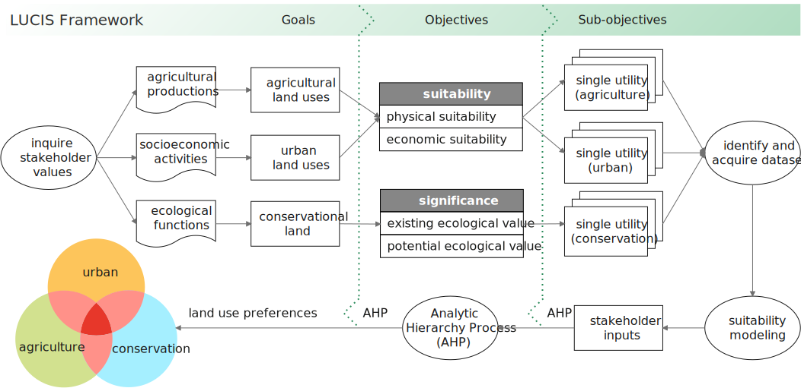

# Workshop 1: Land-Use Suitability Analysis with QGIS Tools

> **Instructor**: [Dr. Changjie Chen](https://github.com/chjch) (<ins>chj.chen@<i></i>ufl.edu</ins>).&nbsp;&nbsp;&nbsp;&nbsp;**Date**: June 1 - August 10, 2021
     
### Goal

The first GALUP workshop aims at laying a foundation of core
concepts and techniques used in land-use suitability analysis, of which the
output will help inform land-use decision making.
Using QGIS, an open-source Geographic Information System (GIS) software
application, and the Processing Algorithms developed by the GALUP team, at the
conclusion of the workshop, trainees should be able to independently visualize
GIS data, conduct geospatial analysis, and identify suitable areas for a
particular land-use purpose.

### Objectives

- Understand key concepts in land use analysis
- Be familiar with the QGIS software
- Use LUCIS-Open Tools for QGIS to perform geospatial analysis
- Create models for suitability analysis using Graphical Modeler
- Interpret the result of land-use suitability analysis
- Making decisions when different purposes of land use are in conflict

### About the Land Use Planning Framework

The planning framework GALUP proposed is based on the Land-Use Identification
Strategy (LUCIS) developed by two professors, Margaret Carr and Paul Zwick, at
the University of Florida. LUCIS, at its core, is a GIS-based land-use
suitability modeling framework. LUCIS models were originally developed using
ModelBuilder in ArcMap&trade;.
The GALUP team developed the **LUCIS-OPEN Tools for QGIS** by using
[PyLUSAT](https://github.com/chjch/pylusat)—Python for Land-Use Suitability
Analysis Tools—and the [QGIS Python API](https://qgis.org/pyqgis/3.10/).
These tools enable land-use planners to perform suitability analysis on
[QGIS](https://docs.qgis.org/3.10/en/docs/user_manual/preamble/foreword.html#foreword),
an open-source GIS software application.

## 1. Modules

1. [Module 1 - Software and Data Preparation](module1.md)
2. [Module 2 - Introduction to LUCIS-OPEN Tools for QGIS](module2.md)
3. [Module 3 - Create Suitability Models with QGIS Graphical Modeler](module3.md)
4. [Module 4 - Making Land-Use Decisions using the LUCIS Framework](module4.md)

## 2. Schedule

| Date/week               | Time           | Type         | Agenda                                     |
|-------------------------|----------------|--------------|--------------------------------------------|
| 2021.06.01              | 2.5 hours      | synchronous  | Kick-off meeting: introduction & goals     |
| 2021.06.02 - 2021.06.07 | 2.5 hours/week | asynchronous | Module 1                                   |
| 2021.06.08              | 1 hour         | synchronous  | Discussion of module 1                     |
| 2021.06.07 - 2021.06.14 | 2.5 hours/week | asynchronous | Module 1 contd.                            |
| 2021.06.15              | 1 hour         | synchronous  | Discussion of module 1 & intro to module 2 |
| 2021.06.16 - 2021.07.05 | 2 hours/week   | asynchronous | Module 2                                   |
| 2021.07.06              | 1 hour         | synchronous  | Discussion of module 2 & intro to module 3 |
| 2021.07.07 - 2021.07.21 | 2 hours/week   | asynchronous | Module 3                                   |
| 2021.07.22 - 2021.08.02 | 3 hours/week   | asynchronous | Module 4                                   |
| 2021.08.03              | 1.5 hours      | synchronous  | Discussion & conclusion                    |

## 3. Delivery Method

The training will be delivered through the
[GALUP](https://github.com/SERVIR-WA/GALUP) GitHub repository, including
software package, training materials, and exercises. So, we ask every
participant to get a GitHub Account which is completely free.

### 3.1. Create a GitHub Account

1. Go to the GitHub website: [https://github.com/](https://github.com/)
   and **click**
   [**Sign up**](https://github.com/join?ref_cta=Sign+up&ref_loc=header+logged+out&ref_page=%2F&source=header-home).
2. Type in a (1) _Username_, (2) _Email address_, and (3) _Password_ to set up
   your account.
3. Finish the _verification_ step and click **Create account**.
4. You should receive an email from GitHub in the email account you used above.
   Follow the instruction in the email to complete the "sign-up" process.

### 3.2. Turn in the Exercises

At the end of every Module, a dedicated link is provided for you to submit the
completed exercise files. In addition, we ask you to complete a post-training
survey for you to provide us feedbacks and comments to help us improve the
training materials so that we can adjust our materials in the future that
better suit your preferences.

### 3.3. Have an Issue?

GitHub allows user to
[Create an Issue](https://docs.github.com/en/issues/tracking-your-work-with-issues/creating-issues/creating-an-issue)
to get in touch with the developers.
So, if you encounter an issue during the training, please don't hesitate to let
us know by submitting an issue
[here](https://github.com/SERVIR-WA/GALUP/issues/new).
This link will direct you to submit _a blank new issue_ to GALUP repository
without any template.
You can report anything from:

1. Error in installing software,
2. Trouble in using the LUCIS-OPEN Tools for QGIS,
3. Report **bugs** of the tools,
4. Problems with the modules and the exercises, or
5. General comments and/or suggestions.
