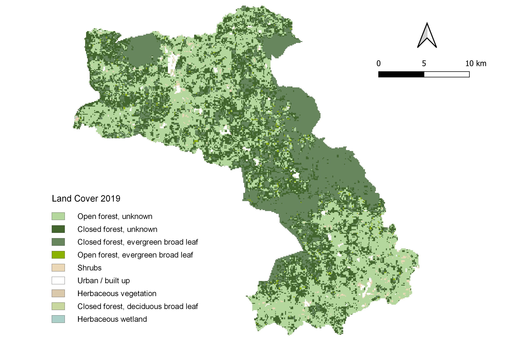
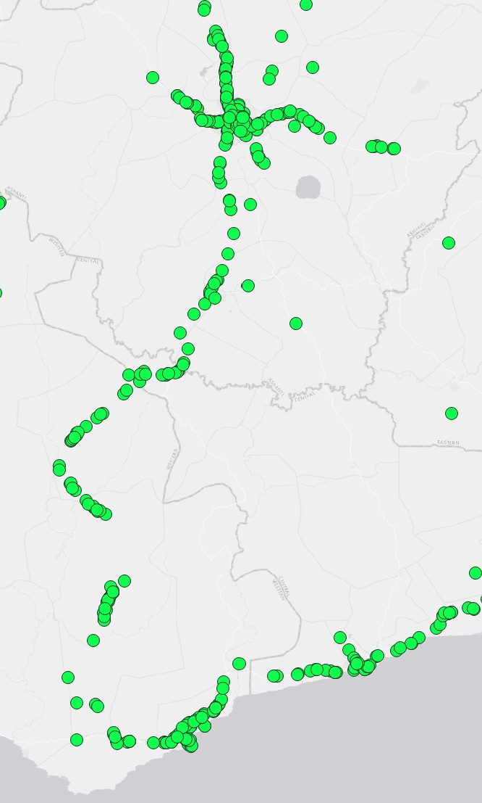
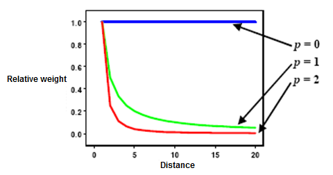
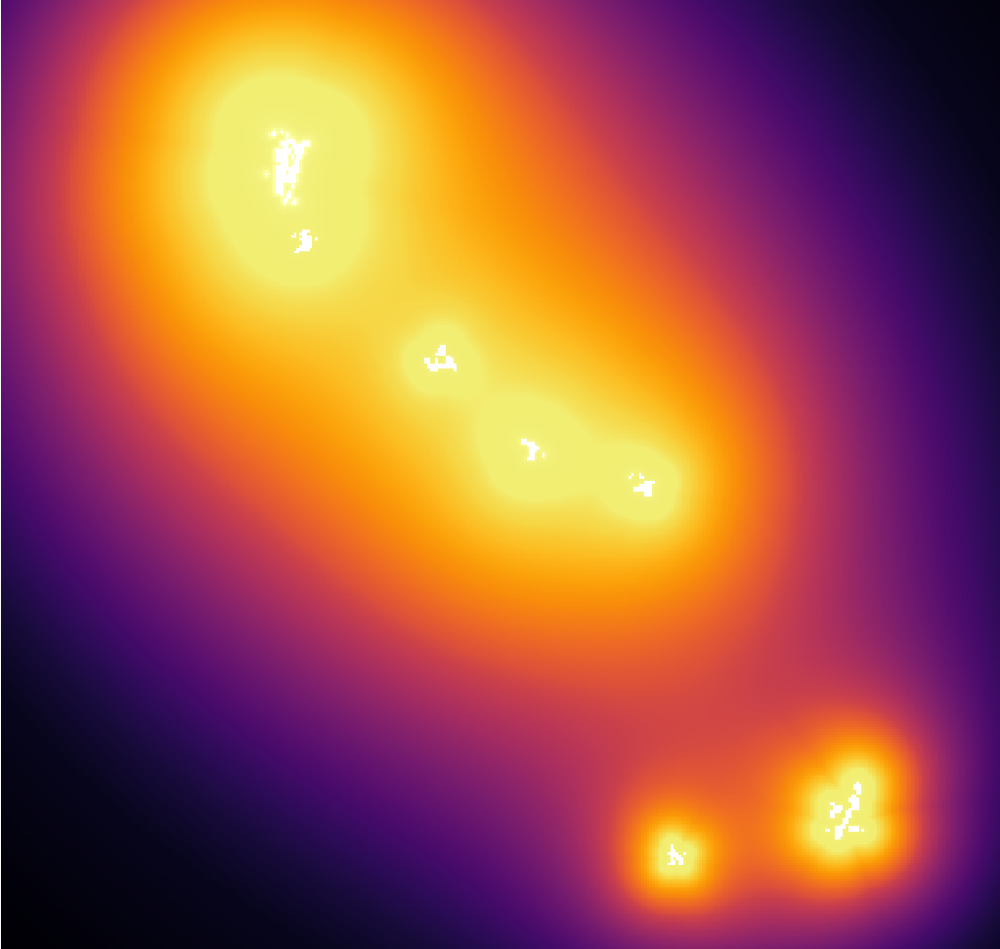
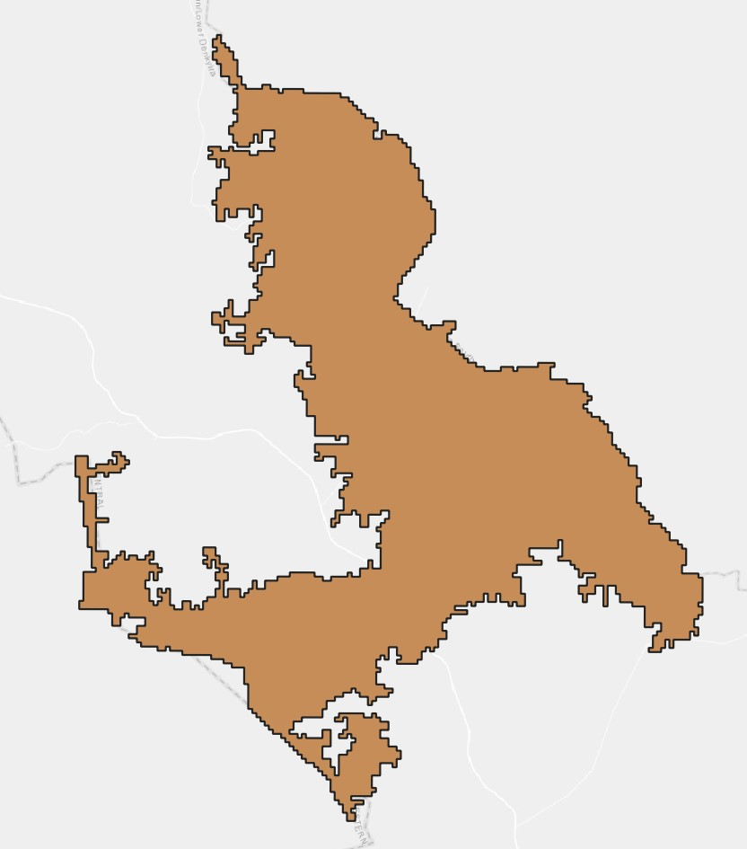
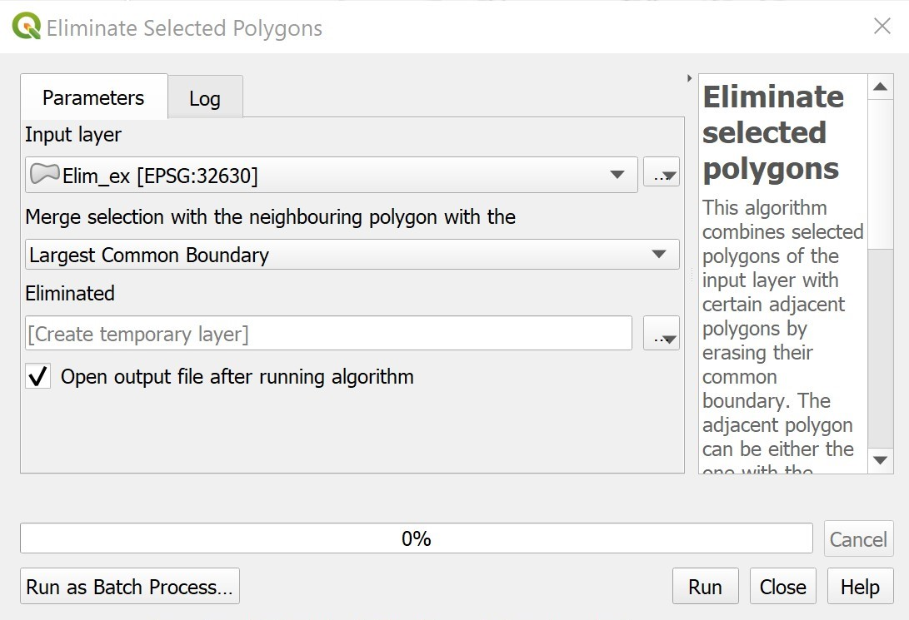
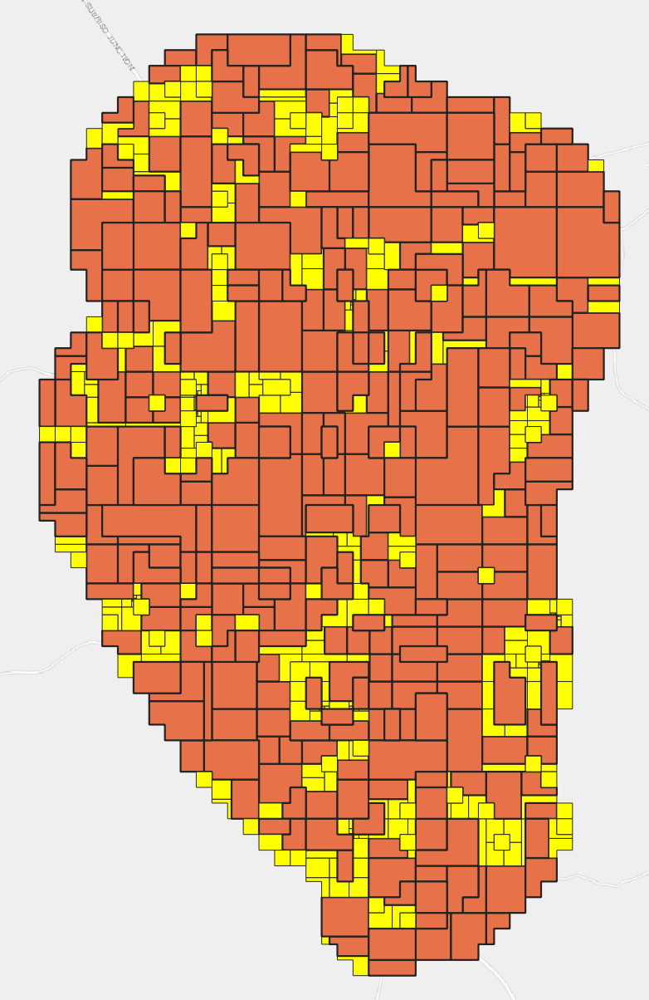
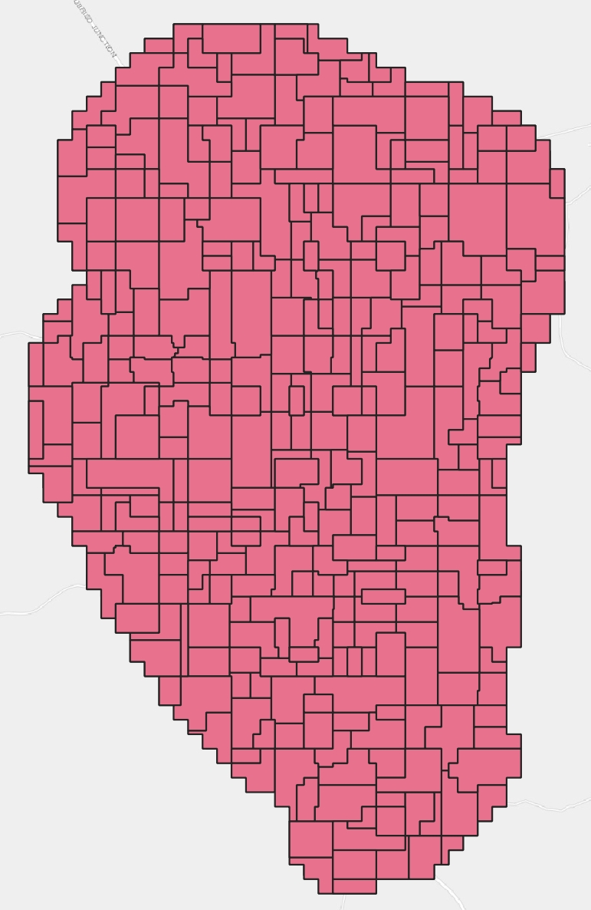
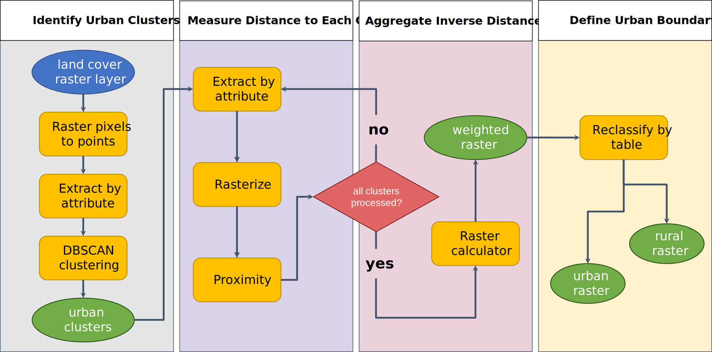

# Integrated Decision Units (IDUs) for Land Use Suitability Modeling

  
Table of Contents (click to expand)

- [Integrated Decision Units (IDUs) for Land Use Suitability Modeling](#integrated-decision-units-idus-for-land-use-suitability-modeling)
  - [1. Introduction](#1-introduction)
  - [2. Datasets Description](#2-datasets-description)
  - [3. Key Functions](#3-key-functions)
    - [3.1 DBSCAN clustering](#31-dbscan-clustering)
    - [3.2 Proximity](#32-proximity)
    - [3.3 Raster Calculator](#33-raster-calculator)
    - [3.4 Reclassify by Table](#34-reclassify-by-table)
    - [3.5 Subdivide](#35-subdivide)
    - [3.6 Eliminate Selected Polygons](#36-eliminate-selected-polygons)
    - [3.7 v.clean](#37-vclean)
  - [4. The QGIS Workflow of Creating IDUs](#4-the-qgis-workflow-of-creating-idus)
    - [4.1 Developing urban clusters](#41-developing-urban-clusters)
    - [4.2 Calculating IDUs](#42-calculating-idus)
  - [5. Exercise and Post-training Survey](#5-exercise-and-post-training-survey)
  - [Reference](#reference)

## 1. Introduction

> "_**Land units**, or land-mapping units, are areas with and qualities that
> **differ sufficiently** from those of other land units to affect their
> suitability for different land uses._"

As suggested by the title, the workshop deals with creating Integrated Decision
Units (**IDUs**), a vector geographic data represented in polygons.
Two major applications of IDU includes:

- demarcation of a tract of land into smaller (homogeneous) parcels
- creation of (mapping) units for geospatial analysis

We introduce a technical solution for creating IDUs in **QGIS**.
We will begin by introducing the conceptual framework IDU is based on; then,
moving onto QGIS functions that are involved in the particular solution; and,
finally, looking at an example of the THLD District in Ghana.

## 2. Datasets Description

The **homogeneity** of an IDU is determined by land properties or attributes,
such as soil, land cover, slope, elevation, etc.
Therefore, these information should be utilized in the creation of IDUs.
As to which specific ones to use, it is often a combined result of data
availability and the spatial scale of the particular question at hand.
In general, the more datasets are involved in the process of creating IDUs the
more complicated (in terms of granularity) the IDU system will be.
In this workshop, we used two datasets: (1)
<a href="#iSDA land cover">_land cover_</a> and (2)
<a href="#africa soil drainage dataset">_soil drainage_</a>.

  
<u><b>Land Cover</b></u>

  Land cover is used because it reflects the condition of the land surface,
  which is directly related to the _potential_ **land use**.
  For example, when developing a new town, land that is classified as
  "closed forest" would require more labor than land that is "open forest."
  Therefore, it is useful to consider land cover when creating IDUs.

  

  
<u><b>Soil Drainage</u></b>

  Soil drainage is used because it reflect the **permeability** of the land
  surface in natural conditions, which usually indicative to the landform and
  environmental characteristics of the land.

  

> :bell: **Download and Use the Datasets** 
> The datasets can be found at [here](datasets).
> It is organized by two Districts Assembly of Ghana, namely
> **Asante Akim Central** (AAC) District and **Twifo-Hemang Lower Denkyira**
> (THLD) District.
> THLD datasets are used as examples in the following training materials,
> whereas AAC datasets will be used for the exercise.
> To download the datasets, simply click
> [here](https://github.com/SERVIR-WA/GALUP/archive/refs/heads/master.zip),
> which will download the entire GALUP repository as a zip file.
> Unzip the downloaded file and navigate to the appropriate location to use the
> datasets.

## 3. Key Functions

The table below shows all of the tools used in this module. You can
find out more information about each tool by following the attached link.
Later, we will take a more in depth look at 6 functions that are key to this
workflow.

| Raster Analysis     | Vector Analysis             | Conversion               | Selection            |
|---------------------|-----------------------------|--------------------------|----------------------|
| [Raster calculator](https://docs.qgis.org/3.16/en/docs/user_manual/processing_algs/qgis/rasteranalysis.html#qgisrastercalculator)   | [Eliminate selected polygons](https://docs.qgis.org/3.16/en/docs/user_manual/processing_algs/qgis/vectorgeometry.html#qgiseliminateselectedpolygons) | [Rasterize](https://docs.qgis.org/3.16/en/docs/user_manual/processing_algs/gdal/vectorconversion.html#gdalrasterize)  | [Extract by attribute](https://docs.qgis.org/3.16/en/docs/user_manual/processing_algs/qgis/vectorselection.html#qgisextractbyattribute) |
| [Reclassify by table](https://docs.qgis.org/3.16/en/docs/user_manual/processing_algs/qgis/rasteranalysis.html#qgisreclassifybytable) | [v.clean](https://grass.osgeo.org/grass80/manuals/v.clean.html)| [r.to.vect](https://grass.osgeo.org/grass80/manuals/r.to.vect.html)| [Select by expression](https://docs.qgis.org/3.16/en/docs/user_manual/processing_algs/qgis/vectorselection.html#qgisselectbyexpression)|
| [Proximity](https://docs.qgis.org/3.16/en/docs/user_manual/processing_algs/gdal/rasteranalysis.html#gdalproximity)           | [Merge vector layers](https://docs.qgis.org/3.16/en/docs/user_manual/processing_algs/qgis/vectorgeneral.html#qgismergevectorlayers)         | [Raster pixels to points](https://docs.qgis.org/3.16/en/docs/user_manual/processing_algs/qgis/vectorcreation.html#qgispixelstopoints)  |                      |
| [r.null](https://grass.osgeo.org/grass80/manuals/r.null.html)              | [Subdivide](https://docs.qgis.org/3.16/en/docs/user_manual/processing_algs/qgis/vectorgeometry.html#qgissubdivide)                   | [Multipart to singleparts](https://docs.qgis.org/3.16/en/docs/user_manual/processing_algs/qgis/vectorgeometry.html#qgismultiparttosingleparts) |                      |
|                     | [DBSCAN clustering](https://docs.qgis.org/3.16/en/docs/user_manual/processing_algs/qgis/vectoranalysis.html#qgisdbscanclustering)           | [Fix geometries](https://docs.qgis.org/3.16/en/docs/user_manual/processing_algs/qgis/vectorgeometry.html#qgisfixgeometries)           |                      |

### 3.1 DBSCAN clustering

For **Defined distance (DBSCAN)**, if the **Minimum Features per Cluster** can
be found within the **Search Distance** from a particular point, that point
will be marked as a core-point and included in a cluster, along with all points
within the core-distance. A border-point is a point that is within the search
distance of a core-point but does not itself have the minimum number of
features within the search distance. Each resulting cluster is composed of
core-points and border-points, where core-points tend to fall in the middle of
the cluster and border-points fall on the exterior. If a point does not have
the minimum number of features within the search distance and is not a within
the search distance of another core-point (in other words, it is neither a
core-point nor a border-point), it is marked as a noise point and not included
in any cluster.

| |
|:----------------------------------------------:|
|Fig. 2 How DBSCAN is calculated. _Source_: [ESRI.](https://pro.arcgis.com/en/pro-app/latest/tool-reference/spatial-statistics/how-density-based-clustering-works.htm)|

- **Usage**: This tool is used to detect areas where points are concentrated
  and where they are separated by areas that are empty or sparse. Points that
  are not part of a cluster are labeled as noise. The results from running the
  DBSCAN algorithm help us identify points that make up a cluster and points
  that are noise.

- **Example**: As an example, we will use **DBSCAN clustering** to identify
  clusters of gas stations within Ghana. The datasets used are listed below:

| ID | File Name       | Data Format | Type  | Description                    |
|----|-----------------|-------------|-------|--------------------------------|
| 1  | gas_station.shp | vector      | point | Gas station locations in Ghana |

The two figures below display the parameter settings and the output of the
tool.

| Parameter Settings       | Input     |Output      |
| ------------------------ |-----------|----------- |
| | | |

### 3.2 Proximity

The **Proximity** tool calculates the <u>**Euclidean distance**</u> from the
center of the source cell to the center of each of the surrounding cells.
Conceptually, the Euclidean algorithm works as follows: for each cell, the
distance to each source cell is determined by calculating the hypotenuse with
x_max and y_max as the other two legs of the triangle. This calculation derives
the true Euclidean distance, rather than the cell distance. The shortest
distance to a source is determined, and if it is less than the specified
maximum distance, the value is assigned to the cell location on the output
raster.

||
|:---------------------------------------------------------:|
|Determining true Euclidean distance. _Source_: [ESRI](https://pro.arcgis.com/en/pro-app/latest/tool-reference/spatial-analyst/understanding-euclidean-distance-analysis.htm)|

- **Usage**:
  This tool gives the measured Euclidean distance from every cell to the
  nearest source. The distances are measured in the projection units of the
  raster, such as feet or meters, and are measured from cell center to cell
  center.

>:pushpin: The projected units of a raster layer can be found under the
>_information_ tab in the layer properties

- **Example**:
  Now we will use the **Proximity** tool in order to determine the Euclidean
  distance from a gas station cluster to the rest of the raster cells.

| ID | File Name      | Data Format | Description                |
|----|----------------|-------------|----------------------------|
| 1  | r_cluster1.tif | raster      | Cluster 1 in raster format |

The two figures below illustrate the parameters and output of the **Proximity**
tool.

| Parameter Settings       | Output      |
| ------------------------ | ----------- |
| | |

### 3.3 Raster Calculator

The **Raster calculator** tool allows you to create and execute _Map Algebra_
expression that will output a raster.
We will be using a [distance decay](https://www.spatialanalysisonline.com/HTML/Distance_decay_models.htm)
model in order to assign weights to each cluster.
Distance decay, also known as the **Gravity Model** or the Inverse Square Law,
is the tendency of a spatial relationship between one place and another to
weaken as the distance between them increases<a href="#geospatial anlysis">3</a>.

||
|:---------------------------------------------------------:|
|Decrease of weight with distance illustration. _Source_: [ESRI](https://pro.arcgis.com/en/pro-app/2.7/help/analysis/geostatistical-analyst/how-inverse-distance-weighted-interpolation-works.htm)|

- **Usage**:
  The **Raster calculator** tool is used to individually weight and multiply
  proximity rasters together.
  
  The weighting formula that we will use is: _w * 1/distance_.
  
  Where _w_ is equal to the **number of points** (urban pixels) in a cluster
  divided by the total number of points in all clusters.

  Here is what our full equation looks like:
  

- **Example**:

| ID | File Name            | Data Format | Description                       |
|----|----------------------|-------------|-----------------------------------|
| 1  | cluster1_euc_dst.tif | raster      | Euclidean distance from cluster 1 |
| 2  | cluster2_euc_dst.tif | raster      | Euclidean distance from cluster 2 |
| 3  | cluster3_euc_dst.tif | raster      | Euclidean distance from cluster 3 |
| 4  | cluster4_euc_dst.tif | raster      | Euclidean distance from cluster 4 |
| 5  | cluster5_euc_dst.tif | raster      | Euclidean distance from cluster 5 |
| 6  | cluster6_euc_dst.tif | raster      | Euclidean distance from cluster 6 |
| 7  | cluster7_euc_dst.tif | raster      | Euclidean distance from cluster 7 |

The figures below show the parameters and output of the **Raster calculator**
tool.

| Parameter Settings       | Output      |
| ------------------------ | ----------- |
| | |

### 3.4 Reclassify by Table

**Reclassify by table** is a tool that reclassifies a raster band by assigning
new class values based on ranges specified in a fixed table.

- **Usage**:
  This tool is used to reclassify raster values.
  
- **Example**:

| ID | File Name              | Data Format | Description                                            |
|----|------------------------|-------------|--------------------------------------------------------|
| 1  | euc_cluster_output.tif | raster      | Result of adding together the weighted clusters 1 and 2|

The figures below show the parameters and output for the
**Reclassify by table** tool.

> :pushpin: Check the details of an image:  
> If you can't see the image clearly, click on the image to view it in a
> new page, which will show the image in its original size.

| Parameter Settings       | Table parameters      | Output|
| ------------------------ | ----------- |--------|
|  | ||

> :pushpin: Here is a helpful strategy:
> If you want to keep track of what raster cells are combined when multiplying
> raster layers together, try reclassifying the raster values as prime numbers.
> The product of two prime numbers can only be the result of those specific
> numbers, allowing you to identify what cells were combined.

### 3.5 Subdivide

**Subdivide** is a tool that subdivides the original geometry into smaller
parts, where no part has more than the specified maximum number of nodes.

- **Usage**:
  The **subdivide** tool is used to break down complex geometries into more
  manageable parts. In our case, this tool allows us to subdivide large areas
  of land into IDUs.

- **Example**:

| ID | File Name        | Data Format |Type    | Description                     |
|----|------------------|-------------|--------|---------------------------------|
| 1  | subdivide_ex.shp | vector      |polygon | Geographic area to be subdivided|

The figures below show the parameters and output for the **Subdivide** tool.

|Parameter Settings | Input       | Output      |
|------| ------------------------ | ----------- |
|| | |

### 3.6 Eliminate Selected Polygons

**Eliminate selected polygons** is a tool that combines selected polygons by
erasing the common boundary with nearby polygons. The merge can be based on
largest common boundary, largest area or smallest area.

- **Usage**:
  **Eliminate selected polygons** is used to refine the IDUs by eliminating
  sliver polygons and other irregularities.

- **Example**

| ID | File Name        | Data Format |Type    | Description                    |
|----|------------------|-------------|--------|--------------------------------|
| 1  | eliminate_ex.shp | vector      |polygon | Input polygons to be eliminated|

The figures below show the parameters for the **Eliminate selected polygons**
tool.

|Parameter Settings | Input  | Output      |
|-------------------|------------------------ | ----------- |
|| | |

> :pushpin: Note: This workflow utilized largest common boundary as the
> parameter for Eliminate selected polygons because this gave us the best
> result. Try using the other methods for merging with the neighboring polygons
> to see which gives you the best result.

### 3.7 v.clean

**v.clean** is a tool that cleans input layers using a selection of tools.
The table below shows what tools are available:
|v.clean |       |         |         |         |
|--------|-------|---------|---------|---------|
|break   |snap   |rmdangle |chdangle |rmbridge |
|chbridge|rmdupl |rmdac    |bpol     |prune    |
|rmarea  |rmline |rmsa     |

There is also an optional parameter called _Input feature type_ which allows
you to specify what you want to be cleaned. This makes the **v.clean** tool
more effective. The table below shows the possible input feature types:

|v.clean  |       |         |         |
|---------|-------|---------|---------|
|area     |point  |line     |boundary |
|centroid |face   | kernel  |

- **Usage**:
  The **v.clean** tool is used for making each of the IDUs more regularly
  shaped. We will be utilizing all of the tools to clean our feature type,
  which is area.

- **Example**:

| ID | File Name    | Data Format |Type    | Description                |
|----|--------------|-------------|--------|----------------------------|
| 1  | clean_ex.shp | vector      |polygon | Input polygon to be cleaned|

The figures below show the parameters and output for the **v.clean** tool.

|Parameter Settings | Input  | Output      |
|-------------------|------------------------ | ----------- |
|| | |

>:pushpin: Note: In order for this tool to work, you must specify a location
>for the output shapefile to be saved.

## 4. The QGIS Workflow of Creating IDUs 

The diagrams below show the general process of the IDU workflow.

### 4.1 Developing urban clusters

The first part of the IDU workflow focuses on **developing urban clusters** and
**distinguishing the boundary** between these clusters and the rest of the THLD
District. This can be done through a series of 4 geoprocessing steps:
identify urban clusters, measure distance to each cluster, aggregate inverse
distance raster, and define urban boundary.

- In order to **identify urban clusters**, urban areas of the THLD District
  must first be extracted from the base land use raster.
  This was done by converting the land use raster to vector points and then
  extracting points according to their land use designation.
  Points designated with land use type <u>**6**</u> make up the urban areas
  that we are looking for.
  Once these have been extracted, they are entered into the DBSCAN clustering
  tool.
  <u>The output from the DBSCAN tool is our urban clusters.</u>
- Now that DBSCAN has identified urban clusters, each of these clusters must
  individually be **extracted**, **converted to raster**, and then **processed
  using the proximity tool**.
- After completing the previous steps, we can move on to **calculating the area
  of influence** for each cluster. This influence is calculated by dividing the
  number of points in a cluster by the total number of points for all clusters.
  These are now weighted using the _inverse distance formula_, where
  <u>**1**</u> is divided by the proximity raster and multiplied by the weight.
- To define the boundary between the urban and rural areas of the THLD
  District, we can **reclassify our weighted raster**. This reclassified raster
  will be binary, where <u>**1**</u> corresponds to the urban area and
  <u>**0**</u> corresponds to the rural area.

|Developing urban clusters                      |
|-----------------------------------------------|
||

  
<b>IDU part 1 video demo (click to watch)</b>

> :bulb: A quick note on the **Reclassification table** 
> The output raster generated by multiplying proximity rasters and their
> respective weights is monotonically increasing.
> In other words, there are no 0 values at the center of an urban cluster.
> Therefore, the "Reclassification table" shown at about "07:30" of the video
> demo can be simplified with only two classes as:
> | Minimum | Maximum | Value |
> |---------|---------|-------|
> | 0       | 0.0039  | 0     |
> | 0.0039  | 1       | 1     |

### 4.2 Calculating IDUs

The second part of the IDU workflow focuses on the actual **calculating of the
IDUs**. This can be done by performing the following 4 geoprocessing functions:
overlay input rasters, separate rural and urban areas, process vector data
(iteration) and merge results.

- The first step in calculating the IDUs is to **create the base suitability
  raster**.
  In order to make the calculations easier, we are going to **reclassify** the
  land cover raster into <u>three general categories</u>.
  Once this is done, the generalized land cover and drainage rasters are ready
  to be combined.
  In order to combine these rasters, they must first be **reclassified as
  prime numbers**.
  The reason we do this is to keep track of what <u>raster values are combined
  when we multiply the land cover and drainage rasters together</u>
  (for further explanation on why we use prime numbers, you can refer back to
  section 3.3 Raster Calculator).
  After the layers are reclassified, they are **multiplied together** using
  raster calculator.
- Next, the combined suitability raster needs to be **separated into urban
  and rural areas**. This is where we use the urban and rural rasters that were
  calculated in the first part of the IDU workflow. The combined raster is
  **multiplied** by the urban and rural rasters, respectively. <u>This
  calculation maintains the suitability of the targeted area while setting the
  rest of the raster equal to **0**</u>. After this is done for both the urban
  and rural rasters,
  the **r.null** tool is used to convert the <u>**0**</u> raster values to
  <u>**No Data**.</u>
- With the urban and rural parts of the suitability raster separated, it is
  time to create the first iteration of the IDUs. Starting with either the
  urban or rural suitability rasters, r.to.vect is used to **convert the raster
  layer** to a vector layer. The fix geometries tool is then used on the vector
  layer, **creating a valid input** for the subdivide tool. <u>The subdivide
  tool
  returns a multipart polygon which must be converted to a single part polygon
  before further processing.</u> At this point, the subdivided areas are very
  small and irregular. This is addressed by **eliminating very small polygons**
  and merging them with other nearby, larger polygons. <u>Multiple iterations
  are required in order to create regular, consistent IDUs.</u>
- Once the IDUs have been established, all that is left to do is some **final
  cleaning** (if you choose) and to **merge** the urban and rural layers back
  together.
  The v.clean tool is used to make the IDUs more regularly shaped. This change
  is very subtle and is not required if you feel that your IDUs are regular
  enough already. The urban IDUs and rural IDUs can then be **merged** to
  create the final IDU layer.

| Calculating IDUs                                |
|-------------------------------------------------|
|  |

> The GIS process described above leads us to the final IDUs of THLD district.
> It is worth noting that the output may not be identical or 100% reproducible
> due to the fact that there are multiple **iterative processes** involved and
> Here, one output is presented in the map below (_click to expand_).
> The output shapefile is also provided and can be found at
> [here](./datasets/IDU_Output).
> You can locate the file in the downloaded zip file of this GitHub repository
> and visualize it in QGIS.

  
THLD Final IDU Map

## 5. Exercise and Post-training Survey

- Please complete this [Exercise](exercise.md).
- Please submit your exercise [here](https://github.com/SERVIR-WA/GALUP/issues/new?assignees=eidealex&labels=exercise+w3&template=w3-exercise-submission.md&title=Workshop+3+exercise+%5Breplace+with+your+name%5D).
- Please take this post-training
  [survey](https://ufl.qualtrics.com/jfe/form/SV_0vNRnI3WsOjXM1g) (required).

## Reference

1. Buchhorn, M., Lesiv, M., Tsendbazar, N.-E.,
   Herold, M., Bertels, L., & Smets, B. (2020). Copernicus Global Land Cover
   Layers—Collection 2. _Remote Sensing_, 12(6).
   https://doi.org/10.3390/rs12061044
2. Hengl, T., Heuvelink, G. B. M.,
   Kempen, B., Leenaars, J. G. B., Walsh, M. G., Shepherd, K. D., Sila, A.,
   MacMillan, R. A., De Jesus, J. M., Tamene, L., & Tondoh, J. E. (2015).
   Mapping Soil Properties of Africa at 250 m Resolution: Random Forests
   Significantly Improve Current Predictions. _PLOS ONE_, 10(6), e0125814.
   https://doi.org/10.1371/JOURNAL.PONE.0125814
3. de Smith, M. J., Goodchild, M. F., &
   Longley, P. A. (2018). Geospatial analysis: A comprehensive guide to
   principles, techniques and software tools (6th ed.).
   https://www.spatialanalysisonline.com/HTML/index.html
