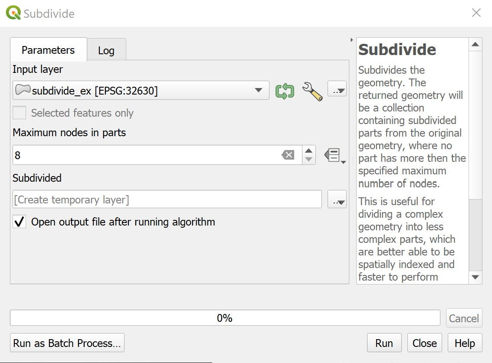
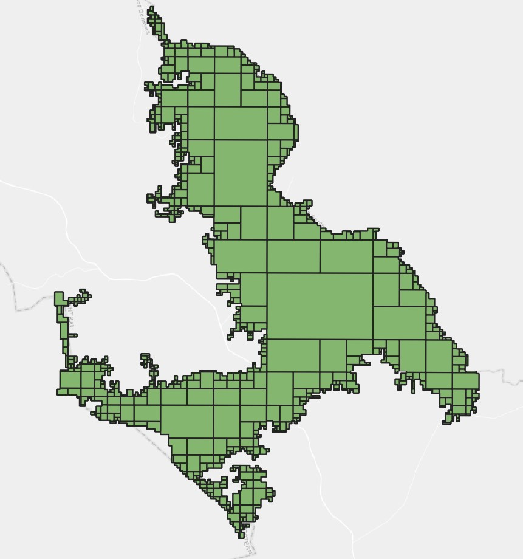
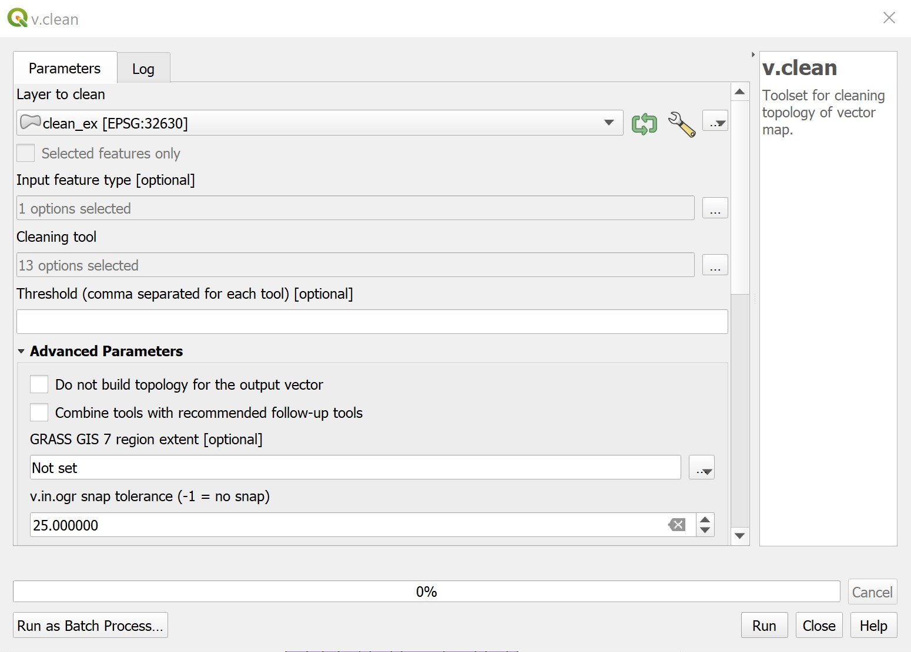
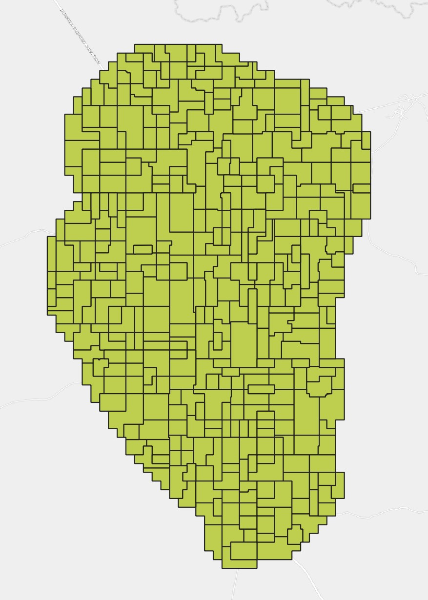
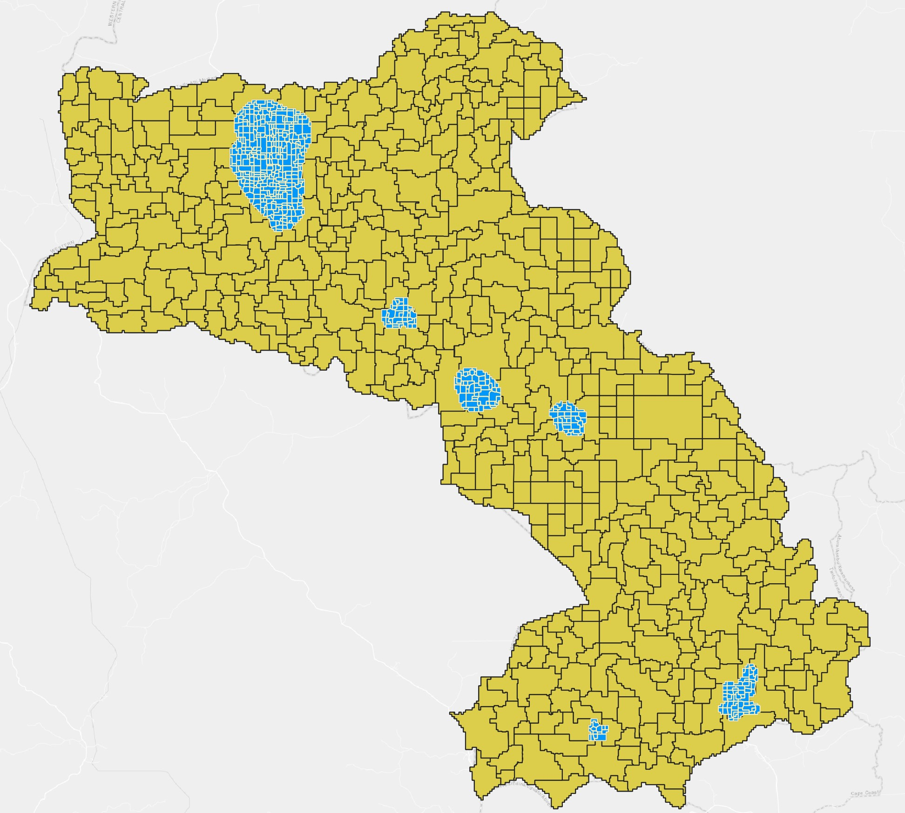

# Integrated Decision Units (IDUs) for Land Use Suitability Modeling

  
Table of Contents (click to expand)

- [Integrated Decision Units (IDUs) for Land Use Suitability Modeling](#integrated-decision-units-idus-for-land-use-suitability-modeling)
  - [1. Introduction](#1-introduction)
    - [1.1 An Integral Part of Land-Use Planning](#11-an-integral-part-of-land-use-planning)
    - [1.2 Some key concepts](#12-some-key-concepts)
    - [1.3 Implication of IDU](#13-implication-of-idu)
  - [2. Datasets Description](#2-datasets-description)
  - [3. Key Functions](#3-key-functions)
    - [3.1 DBSCAN clustering](#31-dbscan-clustering)
    - [3.2 Proximity](#32-proximity)
    - [3.3 Raster Calculator](#33-raster-calculator)
    - [3.4 Reclassify by Table](#34-reclassify-by-table)
    - [3.5 Subdivide](#35-subdivide)
    - [3.6 v.clean](#36-vclean)
  - [4. IDU Workflow](#4-idu-workflow)
    - [4.1 Developing urban clusters](#41-developing-urban-clusters)
    - [4.2 Calculating IDUs](#42-calculating-idus)
    - [4.3 Final IDU Map](#43-final-idu-map)
  - [Exercise and Post-training Survey](#exercise-and-post-training-survey)
  - [Reference](#reference)

## 1. Introduction

As suggested by the title, the workshop deals with creating Integrated Decision
Units (**IDUs**), a vector geographic data represented in polygons.
Two major applications of IDU includes:

- demarcation of a tract of land into smaller (homogeneous) parcels
- creation of (mapping) units for geospatial analysis

We introduce a technical solution for creating IDUs in **QGIS**.
We will begin by introducing the conceptual framework IDU is based on; then,
moving onto QGIS functions that are involved in the particular solution; and,
finally, looking at an example of the THLD District in Ghana.

### 1.1 An Integral Part of Land-Use Planning

In 1976, the Food and Agriculture Organization (FAO) of the United Nations
published <a href="#a framework for land evaluation">
<i>A Framework for Land Evaluation</i></a>, in which a system of philosophy and
principles on the evaluation of land potential was developed.
The **_framework_** was tested and adopted in many countries.
In 1990, FAO published another report,
<a href="#land evaluation for development">
<i>Land Evaluation for Development</i></a>,
reiterated the significance of reliable **land evaluation** in the context of
land-use planning and rural development, i.e., developing a rural area into
a denser (urban) area.
In this newer report, land evaluation and its relationship to (i.e., being a
part of) the overall land-use planning process was further elaborated.
As shown in the figure below, land evaluation is a procedure between Stage 2
and Stage 6, as well as a part of the Stage 7.

|  |
|:---------------------------------------------------------------------------:|
| Fig 1. The process of land-use planning. _Source_: FAO. (1990).             |

The Stage 4, in parallel with identifying land uses (Stage 3), is identifying
land units, e.g., IDUs.

### 1.2 Some key concepts

> "_**Land units**, or land-mapping units, are areas with and qualities that
> **differ sufficiently** from those of other land units to affect their
> suitability for different land uses._"

- Land Unit: areas of land with specific characteristics (or qualities).
- Land Characteristic: simple attribute that can be measured or estimated. For
  example, _mean annual rainfall_.
- Land Quality: a complex attribute that usually reflects the interaction of
  many land characteristics, such as _susceptibility to flooding_.

Although any parcel of land can be considered a land unit, it is more efficient
and meaningful to use parcels that can be adequately described in terms of one
or a combination of land properties.
A land unit should therefore represent an area that is, in terms of
predetermined properties, different from the surrounding land and can be
assumed to have **homogeneous** land properties.

IDUs essentially are a set of spatial containers, modeled as a set of
polygon-based Geographic Information System (GIS) coverages containing
spatially explicit depictions of landscape attributes and patterns.

IDUs are created based on information from multiple sources, such as
parcel-level information, floodplain delineations, and soil permeability.
By using vector-based GIS including intersection, expansion, grouping, etc., we
can merge the information together to generate a layer of IDUs.

Since IDUs are created based on traits of a landscape, the area within an IDU
is deemed homogeneous, so a single uniform decision can be made about that IDU
without worrying about conflicts caused by heterogeneity.

### 1.3 Implication of IDU

IDUs essentially are a set of polygons with definite boundaries.
We assign a specific use for each IDU (based on suitability analysis).
This assignment is simply referred to as a land-use decision.
Since land-use decisions are intrinsically discrete (two adjacent parcels can
have different uses, for example), a vector (polygon) representation is more
applicable than a raster representation.
That's why we need to have a system of polygons, such as IDUs, to begin with.
This is the first, however, critical step to achieving a spatially explicit
land-use plan.

## 2. Datasets Description

The **homogeneity** of an IDU is determined by land properties or attributes,
such as soil, land cover, slope, elevation, etc.
Therefore, these information should be utilized in the creation of IDUs.
As to which specific ones to use, it is often a combined result of data
availability and the spatial scale of the particular question at hand.
In general, the more datasets are involved in the process of creating IDUs the
more complicated (in terms of granularity) the IDU system will be.
In this workshop, we used two datasets: (1) **land cover** and (2)
**soil drainage**.

  
<u><b>Land Cover</b></u>

  Land cover is used because it reflects the condition of the land surface,
  which is directly related to the _potential_ **land use**.
  For example, when developing a new town, land that is classified as
  "closed forest" would require more labor than land that is "open forest."
  Therefore, it is useful to consider land cover when creating IDUs.

  

  
<u><b>Soil Drainage</u></b>

  Soil drainage is used because it reflect the **permeability** of the land
  surface in natural conditions, which usually indicative to the landform and
  environmental characteristics of the land.

  

> :bell: **Download and Use the Datasets** 
> The datasets can be found at [here](datasets).
> It is organized by two Districts Assembly of Ghana, namely
> **Asante Akim Central** (AAC) District and **Twifo-Hemang Lower Denkyira**
> (THLD) District.
> THLD datasets are used as examples in the following training materials,
> whereas AAC datasets will be used for the exercise.
> To download the datasets, simply click
> [here](https://github.com/SERVIR-WA/GALUP/archive/refs/heads/master.zip),
> which will download the entire GALUP repository as a zip file.
> Unzip the downloaded file and navigate to the appropriate location to use the
> datasets.

## 3. Key Functions

The table below shows all of the tools used in this module. You can
find out more information about each tool by following the attached link. 
Later, we will take a more in depth look at 6 functions that are key to this
workflow.

| Raster Analysis     | Vector Analysis             | Conversion               | Selection            |
|---------------------|-----------------------------|--------------------------|----------------------|
| [Raster calculator](https://docs.qgis.org/3.16/en/docs/user_manual/processing_algs/qgis/rasteranalysis.html#qgisrastercalculator)   | [Eliminate selected polygons](https://docs.qgis.org/3.16/en/docs/user_manual/processing_algs/qgis/vectorgeometry.html#qgiseliminateselectedpolygons) | [Rasterize](https://docs.qgis.org/3.16/en/docs/user_manual/processing_algs/gdal/vectorconversion.html#gdalrasterize)  | [Extract by attribute](https://docs.qgis.org/3.16/en/docs/user_manual/processing_algs/qgis/vectorselection.html#qgisextractbyattribute) |
| [Reclassify by table](https://docs.qgis.org/3.16/en/docs/user_manual/processing_algs/qgis/rasteranalysis.html#qgisreclassifybytable) | [v.clean](https://grass.osgeo.org/grass80/manuals/v.clean.html)| [r.to.vect](https://grass.osgeo.org/grass80/manuals/r.to.vect.html)| [Select by expression](https://docs.qgis.org/3.16/en/docs/user_manual/processing_algs/qgis/vectorselection.html#qgisselectbyexpression)|
| [Proximity](https://docs.qgis.org/3.16/en/docs/user_manual/processing_algs/gdal/rasteranalysis.html#gdalproximity)           | [Merge vector layers](https://docs.qgis.org/3.16/en/docs/user_manual/processing_algs/qgis/vectorgeneral.html#qgismergevectorlayers)         | [Raster pixels to points](https://docs.qgis.org/3.16/en/docs/user_manual/processing_algs/qgis/vectorcreation.html#qgispixelstopoints)  |                      |
| [r.null](https://grass.osgeo.org/grass80/manuals/r.null.html)              | [Subdivide](https://docs.qgis.org/3.16/en/docs/user_manual/processing_algs/qgis/vectorgeometry.html#qgissubdivide)                   | [Multipart to singleparts](https://docs.qgis.org/3.16/en/docs/user_manual/processing_algs/qgis/vectorgeometry.html#qgismultiparttosingleparts) |                      |
|                     | [DBSCAN clustering](https://docs.qgis.org/3.16/en/docs/user_manual/processing_algs/qgis/vectoranalysis.html#qgisdbscanclustering)           | [Fix geometries](https://docs.qgis.org/3.16/en/docs/user_manual/processing_algs/qgis/vectorgeometry.html#qgisfixgeometries)           |                      |

### 3.1 DBSCAN clustering
For **Defined distance (DBSCAN)**, if the **Minimum Features per Cluster** can
be found within the **Search Distance** from a particular point, that point 
will be marked as a core-point and included in a cluster, along with all points
within the core-distance. A border-point is a point that is within the search
distance of a core-point but does not itself have the minimum number of 
features within the search distance. Each resulting cluster is composed of 
core-points and border-points, where core-points tend to fall in the middle of 
the cluster and border-points fall on the exterior. If a point does not have 
the minimum number of features within the search distance and is not a within 
the search distance of another core-point (in other words, it is neither a 
core-point nor a border-point), it is marked as a noise point and not included 
in any cluster.

| |
|:----------------------------------------------:|
|Fig. 2 How DBSCAN is calculated. _Source_: [ESRI.](https://pro.arcgis.com/en/pro-app/latest/tool-reference/spatial-statistics/how-density-based-clustering-works.htm)| 

- **Usage**: This tool is used to detect areas where points are concentrated 
  and where they are separated by areas that are empty or sparse. Points that 
  are not part of a cluster are labeled as noise. The results from running the 
  DBSCAN algorithm help us identify points that make up a cluster and points 
  that are noise.

- **Example**: As an example, we will use **DBSCAN clustering** to identify 
  clusters of gas stations within Ghana. The datasets used are listed below:

| ID | File Name       | Data Format | Type  | Description                    |
|----|-----------------|-------------|-------|--------------------------------|
| 1  | gas_station.shp | vector      | point | Gas station locations in Ghana |

The two figures below display the parameter settings and the output of the 
tool.

| Parameter Settings       | Output      |
| ------------------------ | ----------- |
| | |

### 3.2 Proximity
The **Proximity** tool calculates the <u>**Euclidean distance**</u> from the 
center of the source cell to the center of each of the surrounding cells. 
Conceptually, the Euclidean algorithm works as follows: for each cell, the 
distance to each source cell is determined by calculating the hypotenuse with 
x_max and y_max as the other two legs of the triangle. This calculation derives
the true Euclidean distance, rather than the cell distance. The shortest 
distance to a source is determined, and if it is less than the specified 
maximum distance, the value is assigned to the cell location on the output 
raster.

||
|:---------------------------------------------------------:|
|Determining true Euclidean distance. _Source_: [ESRI (2021)](https://pro.arcgis.com/en/pro-app/latest/tool-reference/spatial-analyst/understanding-euclidean-distance-analysis.htm)|

- **Usage**:
  This tool gives the measured Euclidean distance from every cell to the 
  nearest source. The distances are measured in the projection units of the 
  raster, such as feet or meters,and are measured from cell center to cell 
  center.

>:pushpin: The projected units of a raster layer can be found under the 
>_information_ tab in the layer properties

- **Example**:
  Now we will use the **Proximity** tool in order to determine the Euclidean 
  distance from a gas station cluster to the rest of the raster cells.

| ID | File Name      | Data Format | Description                |
|----|----------------|-------------|----------------------------|
| 1  | r_cluster1.tif | raster      | Cluster 1 in raster format |

The two figures below illustrate the parameters and output of the **Proximity**
tool.

| Parameter Settings       | Output      |
| ------------------------ | ----------- |
| | |

### 3.3 Raster Calculator
The **Raster calculator** tool allows you to create and execute a Map Algebra 
expression that will output a raster. We will be using a distance decay model 
in order to assign weights to each cluster. Distance decay, also known as the 
Gravity Model or the Inverse Square Law, is the tendency of a spatial 
relationship between one place and another to weaken as the distance between 
them increases.

- **Usage**:
  The **Raster calculator** tool is used to individually weight and multiply 
  proximity rasters together.
- The weighting formula that we will use is: 1/W*Cluster
- W = # of points in a cluster / # of total points
- 1/"clus1_prox328@1"*.38 + 1/"clus2_prox328@1"*.06 + 1/"clus3_prox_328@1"*.08 + 1/"clus4_prox328@1"*.2 + 1/"clus5_prox328@1"*.12 + 1/"clus6_prox328@1"*.09 + 1/"clus7_prox328@1"*.06

  **Example**:

| ID | File Name            | Data Format | Description                       |
|----|----------------------|-------------|-----------------------------------|
| 1  | cluster1_euc_dst.tif | raster      | Euclidean distance from cluster 1 |
| 2  | cluster2_euc_dst.tif | raster      | Euclidean distance from cluster 2 |

The figures below show the parameters and output of the **Raster calculator** 
tool.

| Parameter Settings       | Output      |
| ------------------------ | ----------- |
| | |

### 3.4 Reclassify by Table 
**Reclassify by table** is a tool that reclassifies a raster band by assigning 
new class values based on ranges specified in a fixed table.

- **Usage**:
  This tool is used to reclassify raster values. 
  

- **Example**:

| ID | File Name              | Data Format | Description                                            |
|----|------------------------|-------------|--------------------------------------------------------|
| 1  | euc_cluster_output.tif | raster      | Result of adding together the weighted clusters 1 and 2|

The figures below show the parameters and output for the 
**Reclassify by table** tool.

> :pushpin: Check the details of an image:  
> If you can't see the image clearly, click on the image to view it in a
> new page, which will show the image in its original size.

| Parameter Settings       | Table parameters      | Output|
| ------------------------ | ----------- |--------|
|  | ||

> :pushpin: Here is a helpful strategy:
> If you want to keep track of what raster cells are combined when multiplying 
> raster layers together, try reclassifying the raster values as prime numbers.
> The product of two prime numbers can only be the result of those specific
> numbers, allowing you to idnetify what cells were combined.

### 3.5 Subdivide 
**Subdivide** is a tool that subdivides the original geometry into smaller 
parts, where no part has more than the specified maximum number of nodes. 

- **Usage**:
  The **subdivide** tool is used to break down complex geometries into more 
  manageable parts. In our case, this tool allows us to subdivide large areas 
  of land into IDUs.

- **Example**:

| ID | File Name        | Data Format |Type    | Description                     |
|----|------------------|-------------|--------|---------------------------------|
| 1  | subdivide_ex.shp | vector      |polygon | Geographic area to be subdivided|

The figures below show the parameters and output for the **Subdivide** tool.

|Input | Parameter Settings       | Output      |
|------| ------------------------ | ----------- |
|| | |

### 3.6 v.clean
**v.clean** is a tool that cleans input layers using a selection of tools.
The table below shows what tools are available:
|v.clean |       |         |         |         |
|--------|-------|---------|---------|---------|
|break   |snap   |rmdangle |chdangle |rmbridge |
|chbridge|rmdupl |rmdac    |bpol     |prune    |
|rmarea  |rmline |rmsa     |

There is also an optional parameter called _Input feature type_ which allows 
you to specify what you want to be cleaned. This makes the **v.clean** tool
more effective. The table below shows the possible input feature types:

|v.clean  |       |         |         |
|---------|-------|---------|---------|
|area     |point  |line     |boundary |
|centroid |face   | kernel  |

- **Usage**: 
- The **v.clean** tool is used for making each of the IDUs more regularly
  shaped. We will be utilizing all of the tools to clean our feature type,
  which is area.

- **Example**:

| ID | File Name    | Data Format |Type    | Description                |
|----|--------------|-------------|--------|----------------------------|
| 1  | clean_ex.shp | vector      |polygon | Input polygon to be cleaned|

The figures below show the parameters and output for the **v.clean** tool.

|Parameter Settings | Input  | Output      |
|-------------------|------------------------ | ----------- |
|| | |

>:pushpin: In order for this tool to work, you must specify a location for the 
>output shapefile to be saved.
## 4. IDU Workflow

The diagrams below show the general process of the IDU workflow.

### 4.1 Developing urban clusters

The first part of the IDU workflow focuses on developing urban clusters and 
distinguishing the boundary between these clusters and the rest of the THLD 
District. This can be done through a series of 4 geoprocessing steps: 
identify urban clusters, measure distance to each cluster, aggregate inverse 
distance raster, and define urban boundary. 

- In order to identify urban
 clusters, urban areas of the THLD District must first be extracted from the
 base land use raster. This was done by converting the land use raster to 
 vector points and then extracting points according to their land use 
 designation. Points designated with land use type 6 make up the urban areas 
 that we are looking for. Once these have been extracted, they are entered into
 the DBSCAN clustering tool. The output from the DBSCAN tool is our urban 
 clusters.

- Now that DBSCAN has identified urban clusters, each of these clusters must 
  individually be extracted, converted to raster, and then processed using the 
  proximity tool. 

- After completing the previous steps, we can move on to calculating the area 
  of influence for each cluster. This influence is calculated by dividing the 
  number of points in a cluster by the total number of points for all clusters.
  These are now weighted using the inverse distance formula, where 1 is divided
  by the proximity raster and multiplied by the weight.

- To define the boundary between the urban and rural areas of the THLD
  District, we can reclassify our weighted raster. This reclassified raster 
  will be binary, where 1 corresponds to the urban area and 0 corresponds to 
  the rural area.

|Developing urban clusters                      |
|-----------------------------------------------|
||

### 4.2 Calculating IDUs

The second part of the IDU workflow focuses on the actual calculating of the
IDUs. This can be done by performing the following 4 geoprocessing functions:
overlay input rasters, separate rural and urban areas, process vector data 
(iteration) and merge results.

- The first step in calculating the IDUs is to create the base suitability 
  raster. This is done by combining the land cover raster and the drainage
  raster. In order to combine these rasters, they must first be reclassified as
  prime numbers. The reason we do this is to keep track of what raster values
  are combined when we multiply the land cover and drainage rasters together 
  (for further explanation on why we use prime numbers, you can refer back to 
  section 3.3 Raster Calculator). After the layers are reclassified, they are 
  multiplied together using raster calculator. 

- Next, the combined suitability raster needs to be seperated into urban areas
  and rural areas. This is where we use the urban and rural rasters that were 
  calculated in the first part of the IDU workflow. The combined raster is
  multiplied by the urban and rural rasters, respectively. This calculation
  maintains the suitability of the targetted area while setting the rest of the
  raster equal to 0. After this is done for both the urban and rural rasters,
  the r.null tool is used to convert the 0 raster values to No Data.

- With the urban and rural parts of the suitability raster seperated, it is
  time to create the first iteration of the IDUs. Starting with either the
  urban or rural suitability rasters, r.to.vect is used to convert the raster
  layer to a vector layer. The fix geometries tool is then used on the vector
  layer, creating a valid input for the subdivide tool. The subdivide tool
  returns a multipart polygon which must be converted to a single part polygon
  before further processing. At this point, the subdivided areas are very small
  and irregular. This is addressed by eliminating very small polygons and
  merging them with other nearby, larger polygons. Multiple iterations are 
  required in order to create regular, consistent IDUs.

- Once the IDUs have been established, all that is left to do is some final 
  cleaning (if you choose) and to put the urban and rural layers back together.
  The v.clean tool is used to make the IDUs more regularly shaped. This change
  is very subtle and is not required if you feel that your IDUs are regular
  enough already. The urban IDUs and rural IDUs can then be merged to create 
  the final IDU layer.

|Calculating IDUs                               |
|-----------------------------------------------|
||

>:pushpin: If you are having trouble permanently saving your subdivided
>polygons, try saving them as Esri shapefiles (.shp) instead of geopackages 
>(.gpkg).

### 4.3 Final IDU Map
|Final IDU Map                                  |
|-----------------------------------------------|
||

## Exercise and Post-training Survey
* Please complete the Exercise 1.
* Please take this post-training survey (required).

## Reference

1. FAO. (1976). A framework for land evaluation (No. 32; Soils Bulletins). Food and Agriculture Organization of the United Nations. http://www.fao.org/3/X5310E/x5310e00.htm
2. FAO. (1990). Land evaluation for development. Food and Agriculture Organization of the United Nations. https://www.fao.org/3/U1980E/u1980e00.htm
